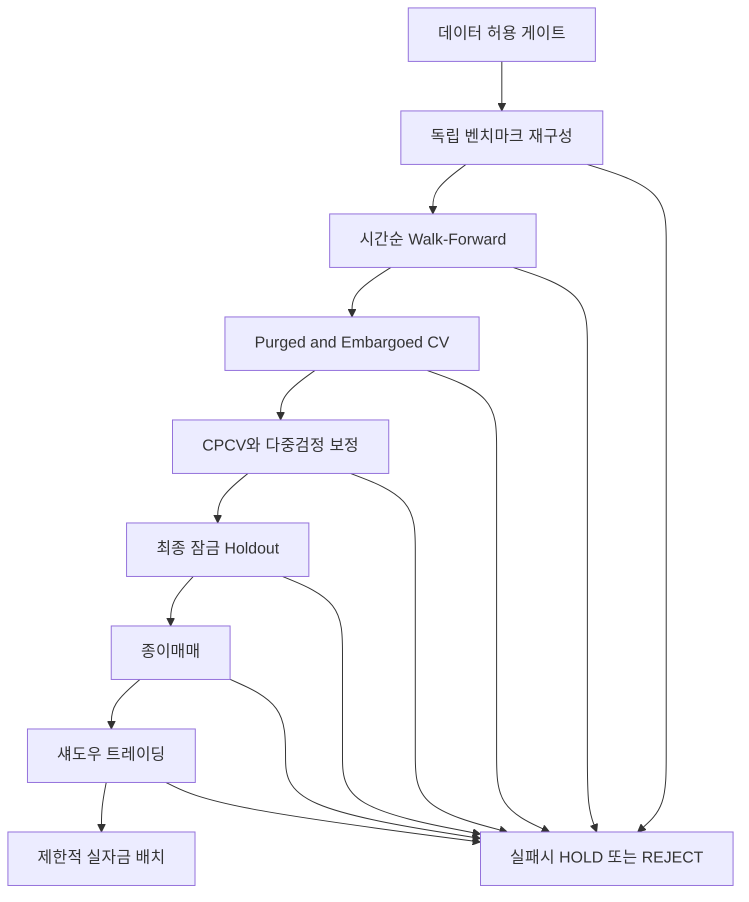
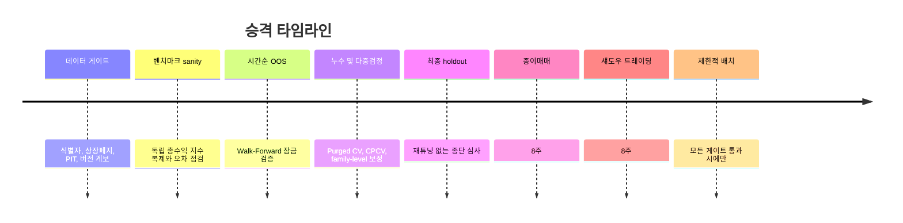

# 소규모 체계적 주식 리서치 시스템을 위한 검증 프로토콜

## 경영진 요약

업로드된 원문은 이번 과업을 “소규모 팀이 운영하는 체계적 주식 리서치 시스템을 그린라이트하기 전에, 미국 선행 프로토타입과 이후 한국 확장을 모두 견딜 수 있는 검증 프로토콜을 설계하는 일”로 정의하고 있습니다. 또한 현재 상태를 **“KR 연구는 차단, U.S. 승격은 보류”**로 명시합니다. fileciteturn0file0

핵심 결론은 다음과 같습니다. **프로토콜 자체는 채택 가능하지만, 실제 전략 승격 판정은 아직 `HOLD`가 맞습니다.** 이유는 간단합니다. 지금 확보된 근거는 “무엇을 검증해야 하는가”에 대해서는 충분히 강하지만, “특정 U.S. 전략 후보가 이미 그 검증을 통과했다”는 실증 근거는 전혀 제시되지 않았기 때문입니다. 따라서 이번 보고서의 합리적 판정은 **프로토콜 채택 = 가능**, **U.S. 승격 = HOLD 유지**, **KR 확장 = BLOCK 유지**입니다. KR 쪽은 특히 시계열 공시 시각, 상장폐지/비활성 종목 이력, 실행비용·라우팅 가정이 아직 보수적으로 고정되어야 합니다. fileciteturn0file0 citeturn11view0turn10view1turn45view0

가장 중요한 설계 원칙은 다섯 가지입니다. 첫째, **PIT 시점 안전성**을 회계기간 종결일이 아니라 실제 공시 수용 시점으로 강제해야 합니다. SEC는 EDGAR APIs와 제출 이력이 실시간으로 갱신되고 공개 사이트 반영도 통상 1분 미만이라고 설명합니다. 반면 OpenDART의 공시검색 API는 기본적으로 `접수일자(rcept_dt)`를 중심으로 응답하며, 활용 화면에 제공되는 정보는 정확성·완전성을 보장하지 않고 반영까지 시간이 걸릴 수 있다고 명시합니다. 둘째, **활성·비활성·상장폐지 종목과 기업행위**가 모두 포함된 데이터만 허용해야 합니다. CRSP는 미국 주식 DB가 활성/비활성 증권을 모두 포함하고, 상장폐지 정보·기업행위·배당 포함/제외 수익률을 제공한다고 밝힙니다. 셋째, **독립 벤치마크 재구성**이 필수입니다. 벤치마크 구성의 사후 시점 정보가 성과를 크게 과장할 수 있다는 연구가 있습니다. 넷째, **시간순 OOS, purged/embargoed 검증, CPCV 및 다중검정 보정**을 함께 써야 합니다. 다섯째, **비용·충격·운용 절차**를 종이매매와 섀도우 트레이딩까지 이어지는 단계적 게이트로 관리해야 합니다. citeturn7view0turn43view0turn11view0turn10view1turn45view0turn41view3turn44academia2turn52academia4turn46academia7

요약하면, 이번 프로토콜의 목표는 “좋아 보이는 백테스트”를 통과시키는 것이 아니라, **데이터 시점 오류·상장폐지 누락·벤치마크 왜곡·모델 선택 편향·거래비용 과소추정**을 하나라도 잡아내면 승격을 멈추는 것입니다. 따라서 그린라이트의 기준은 높은 평균성과가 아니라 **오류를 견디는 구조적 건전성**이어야 합니다. citeturn44academia2turn53academia0turn52academia4

| 판정 항목 | 이번 보고서의 권고 |
|---|---|
| 프로토콜 설계 채택 | **채택 가능** |
| U.S. 전략 승격 | **HOLD 유지** |
| KR 연구 착수 | **BLOCK 유지** |
| 즉시 필요한 조치 | 데이터 게이트 구현, 독립 벤치마크 복제, 다중검정 로깅, 종이매매·섀도우 절차 고정 |

## 연구 범위와 방법

이번 보고서는 **공식 문서와 1차 자료를 최우선**으로 사용했고, 그다음으로 학술 논문과 최근 연구 요약을 사용했습니다. 공식 자료의 중심축은 SEC EDGAR, 금융감독원 OpenDART, CRSP, WRDS이며, 학술 근거는 벤치마크 선행편향, 자산가격 연구의 다중검정·출판편향, 백테스트 과최적화, 거래비용 구조에 관한 문헌입니다. 다만 purged CV, CPCV, DSR/PBO의 원 논문 전문은 이번 환경에서 직접 확보하지 못한 부분이 있어, 그 부분은 최근 응용 연구나 신뢰 가능한 요약 자료에 기대고 증거강도를 한 단계 낮춰 평가했습니다. citeturn7view0turn11view0turn45view0turn40view0turn34view0turn44academia2turn53academia0turn52academia4

| 출처 | 유형 | 이번 보고서에서 뒷받침한 내용 | 시장 관련성 | 최신성·버전 | 증거 강도 |
|---|---|---|---|---|---|
| SEC EDGAR API 문서 citeturn7view0turn43view0 | 공식/1차 | 실시간 갱신, 제출 이력, 제출 상태 API | 미국 PIT 시점 규칙 | 2025-03-27 페이지 기준 | 강함 |
| OpenDART 개발가이드 및 활용 유의사항 citeturn11view0turn10view1 | 공식/1차·한국어 | `rcept_no`, `rcept_dt`, 접수일자 검색, 정보 반영 지연 경고 | 한국 PIT·공시 시점 규칙 | OpenDART 현행 페이지 | 강함 |
| CRSP US Stock Databases citeturn45view0 | 공식/1차 | 활성/비활성/상장폐지, 기업행위, 배당 포함 수익률, 주기적 릴리스 | 미국 데이터 허용 게이트 | 2026 현행 페이지 | 강함 |
| CRSP PERMNO/PERMCO 및 CCM citeturn41view3turn40view1 | 공식/1차 | 영속 식별자, 시계열 연속성, CRSP-Compustat 연결 | 식별자·연결 품질 | 2026 현행 페이지 | 강함 |
| CRSP 지수 방법론 및 릴리스 노트 citeturn40view0turn42view0 | 공식/1차 | 규칙기반 지수, float 조정, turnover 억제, 정기 재구성, 릴리스 추적 | 벤치마크 sanity·버전 관리 | 2026 현행 페이지 | 강함 |
| WRDS 소개 페이지 citeturn34view0 | 공식/플랫폼 | 표준화·검증 지원, 대규모 데이터 허브 | 데이터 계보 관리 | 2026 현행 페이지 | 중간 |
| Daniel·Sornette·Wohrmann citeturn44academia2 | 학술 | 벤치마크 사후편향이 성과를 크게 과장 가능 | 벤치마크 sanity gate | 2008 | 강함 |
| Chen·Zimmermann citeturn53academia0 | 학술 | 다중검정 맥락에서 t-통계 허들 상향 필요 | 모델 선택 규율 | 2022 | 강함 |
| Koshiyama·Firoozye citeturn52academia4 | 학술 | 백테스트 과최적화 문제 유형과 교정 체계 | 검증 설계 | 2019 | 중간 |
| Purged/CPCV/DSR 요약 자료 및 최근 응용 citeturn48search0turn52search6turn48academia1turn28search0 | 2차 요약+응용 | purging·embargo·CPCV·DSR/PBO의 운용 개념 | 통계 검증 계층 | 2024~2026 응용 포함 | 중간 |
| 거래비용 이론 문헌 citeturn46academia7turn25academia3 | 학술 | 거래비용은 spread와 price impact를 포함 | 비용 스트레스 설계 | 2013~2016 | 중간 |

이 보고서의 숫자 임계치 중 일부는 **규제값이 아니라 “하우스 룰” 권고값**입니다. 즉, 공식 문서가 정한 절대 기준이 아니라, 위 근거들을 조합해 “오탐을 줄이는 보수적 기준”으로 설계했습니다. 따라서 숫자 자체보다 중요한 것은 **모든 후보가 동일한 규칙을 사전에 공유하고 사후 조정 없이 적용받는지**입니다. fileciteturn0file0 citeturn53academia0turn52academia4

## 데이터 허용 게이트

검증은 모델부터 시작하면 안 됩니다. **데이터 게이트를 통과하지 못하면 모델 검증은 즉시 중단**되어야 합니다. 미국에 대해서는 이 기준을 비교적 강하게 고정할 수 있습니다. SEC는 제출 이력과 상태를 실시간 API로 제공하고, CRSP는 활성·비활성·상장폐지·기업행위·배당 처리와 영속 식별자를 공식적으로 제공합니다. 반면 한국은 OpenDART가 강력한 공시 기반을 제공하지만, 현재 확보된 공식 텍스트만으로는 거래가능 시각을 SEC 수준으로 세밀하게 자동화하기 어렵습니다. OpenDART API 자체는 `접수일자` 중심이고, 화면 제공 정보는 반영 지연과 정확성·완전성 비보장을 경고합니다. 따라서 한국은 **더 보수적인 tradability rule**이 필요합니다. citeturn7view0turn43view0turn11view0turn10view1turn45view0turn41view3

| 게이트 | 왜 필요한가 | U.S. 통과 조건 | KR 통과 조건 | 실패 시 조치 | 근거 |
|---|---|---|---|---|---|
| 영속 식별자 | 종목 코드 변경·합병·분할 시 시계열 단절 방지 | CRSP `PERMNO/PERMCO` 또는 동급 영속 식별자 사용 | KRX/공급사 식별자 체계가 종목 전생애를 추적함을 문서로 확인 | 데이터셋 반려 | citeturn41view3turn40view1 |
| 활성·비활성·상장폐지 포함 | survivorship bias 제거 | 활성·비활성 종목과 delisting info, corporate actions 모두 포함 | 상장폐지 이력 포함 여부를 공식 문서나 공급사 명세로 확인할 때만 허용 | 모델링 중단 | citeturn45view0 |
| PIT 회계/공시 시점 | look-ahead 방지 | 회계기간 말이 아니라 실제 제출·수용 시각 기준 | OpenDART는 기본적으로 `rcept_dt` 기준. API로 시각이 불명확하면 **다음 정규장부터 tradable**로 보수 적용 | 동일일 거래 금지, 다음 세션으로 이연 | citeturn7view0turn43view0turn11view0turn10view1 |
| 배당·기업행위 총수익 반영 | 총수익 왜곡 방지 | 배당 포함/제외 수익률, 기업행위 반영 총수익 계산 일치 | 동등 수준의 총수익·기업행위 처리 로직을 별도 검증 | 벤치마크 게이트 전 중단 | citeturn45view0turn40view0 |
| 버전·릴리스 계보 | 재현성 확보 | 데이터 릴리스 일자와 release note 해시 저장 | 공시 API 버전, 크롤링 시점, 매핑 테이블 버전 저장 | 재현 불가 판정 | citeturn42view0turn34view0 |
| 독립 벤치마크 재구성 가능성 | 벤치마크 오염 탐지 | float/기업행위/총수익 반영한 cap-weight TR 재구성 가능 | KRX/KIND/공급사 기준지수 정의를 확보할 때만 허용 | 데이터셋 격리 | citeturn40view0turn44academia2 |

한국 시장의 핵심 보수 규칙은 다음 한 줄로 요약됩니다. **OpenDART에서 동일일 접수만 확인되고 공시 시각이 기계적으로 검증되지 않으면, 그 정보는 다음 정규장 개시 이후에만 사용한다.** 이 규칙은 알파를 조금 희생하지만, 시점 오염을 크게 줄입니다. OpenDART가 접수일자를 공식 필드로 제공하고, 별도 지연 가능성을 경고한다는 점을 감안하면 이 보수성은 합리적입니다. citeturn11view0turn10view1

미국 데이터는 반대로 더 엄격한 intraday rule을 채택할 수 있습니다. **EDGAR 수용 시각을 잡을 수 있으면 same-day 이후 바(bar)부터, 그 시각을 안정적으로 잡지 못하면 다음 바 또는 다음 세션부터**라는 규칙이 적절합니다. SEC는 제출 이력이 실시간으로 갱신되고 공개 배포가 일반적으로 1분 이내라고 설명하므로, 이 규칙은 운영 가능성이 높습니다. citeturn7view0turn43view0

## 검증 설계와 통계 규율

본 검증은 단일 백테스트가 아니라 **세 겹의 OOS 구조**로 설계해야 합니다. 첫째는 시간순 walk-forward입니다. 둘째는 누수 제거를 위한 purged/embargoed 검증입니다. 셋째는 조합형 외부검증(CPCV)과 다중검정 보정입니다. 마지막으로, 위 모든 과정에서 모델 선택에 쓰이지 않은 **최종 잠금 holdout**을 별도로 남겨야 합니다. 백테스트 과최적화 연구는 데이터 스누핑, 성과 과대평가, CV 설계 실패가 핵심 취약점임을 지적합니다. 벤치마크 자체도 사후구성 편향을 가질 수 있으므로, 시계열 OOS와 독립 벤치마크 sanity는 같은 수준의 중요도를 가져야 합니다. citeturn52academia4turn44academia2

위 흐름은 원문이 요구한 “before models / before green-lighting” 성격과 최근 과최적화 완화 연구, 그리고 purged/CPCV 운용 개념을 결합한 것입니다. fileciteturn0file0 citeturn52academia4turn48search0turn52search6

| 검증 층위 | 목적 | 장점 | 핵심 리스크 | 이번 프로토콜의 역할 |
|---|---|---|---|---|
| 시간순 Walk-Forward | 실제 연구-배치 흐름 모사 | 가장 직관적이고 운영친화적 | 단일 역사 경로 의존 | **필수 1차 OOS** |
| Purged / Embargoed CV | 표본 누수 차단 | 겹치는 라벨·시점 정보 누수 완화 | 표본 수 감소 | **필수 2차 누수검사** |
| CPCV | 여러 역사 경로에 대한 성과 분포 확보 | 특정 구간 운에 덜 민감 | 계산량 큼 | **필수 3차 안정성 검사** |
| 최종 잠금 Holdout | 진짜 최종 심사 | 파라미터 재조정 유혹 차단 | 길이가 너무 짧으면 잡음 큼 | **승격의 결정 관문** |

검증 로그도 하드 규칙으로 고정해야 합니다. **모델 패밀리별 실험 수, 버전, 후보 탈락 사유, 선택 시점, 비용 가정, 벤치마크 버전, 데이터 릴리스 버전**을 모두 남겨야 합니다. 최근 자산가격 문헌은 다중검정 맥락에서 단순한 `t > 2`는 약하며, 허들이 3.0을 초과하는 경우가 잦다고 지적합니다. 따라서 실험 로그를 남기지 않으면 후보 선택 편향을 나중에 교정할 방법이 없습니다. citeturn53academia0

또 하나의 핵심은 **최종 holdout에 들어간 뒤에는 재튜닝 금지**입니다. 이 단계에서 규칙을 고치면 holdout이 아니라 또 하나의 in-sample이 됩니다. 원문이 강조한 “green-light 이전의 validation protocol”이라는 표현도 바로 이 점을 겨냥합니다. fileciteturn0file0

## 성과·비용·벤치마크 판정 기준

아래 표의 임계치는 **권고값**입니다. 규제기관 기준이 아니라, 이번 프로젝트를 보수적으로 운영하기 위한 하우스 룰입니다. 숫자의 배경은 다음과 같습니다. 벤치마크 편향은 연간 성과를 크게 왜곡할 수 있으므로 매우 엄격한 오차 허용치를 둬야 하고, 통계적 유의성은 다중검정 환경에서 `t > 3` 수준을 염두에 둬야 하며, 비용은 spread와 impact를 동시에 스트레스 테스트해야 합니다. 또한 Sharpe류 지표는 자기상관과 분포특성에 민감하므로, 단일 연율화 Sharpe 하나만으로 승격해선 안 됩니다. citeturn44academia2turn53academia0turn46academia7turn51academia12

| 항목 | 권고 판정 규칙 | 실패 또는 경계 조건 |
|---|---|---|
| 벤치마크 재구성 오차 | 공식 벤치마크 대비 **월평균 절대 오차 ≤ 5bp**, **연환산 총수익 격차 ≤ 30bp** | 초과 시 데이터·기업행위 처리 재검증 전까지 **즉시 HOLD** |
| 최종 holdout 길이 | **최소 252거래일 또는 12회 리밸런스 또는 4개 실적사이클 중 더 긴 기준** | 더 짧으면 신호·비용 판정은 **참고용**으로 강등 |
| 종단 OOS 성과 | base cost 기준 **after-cost active return > 0** 그리고 **benchmark-relative IR > 0.25** | 둘 중 하나라도 미달이면 승격 불가 |
| 교차구간 일관성 | 잠금 OOS 구간의 **70% 이상**에서 after-cost active return 양수 | 50~70%면 **quarantine**, 50% 미만이면 **reject** |
| 신호 품질 | **중앙값 Rank IC > 0**, 테스트 창의 **65% 이상**에서 부호 유지 | 부호 뒤집힘이 잦으면 구조적 불안정 |
| 다중검정 보정 | 후보 패밀리 최종채택은 **조정 후 유의성**을 충족해야 하며, 실무상 **DSR 95% 수준 또는 family-level t-stat > 3**을 권고 | 미달이면 “좋은 백테스트”여도 채택 금지 |
| 과최적화 위험 | **권고 PBO < 0.20**, 0.20~0.35는 quarantine, 0.35 초과는 reject | PBO가 높으면 모델 선택 과정 자체가 오염되었을 가능성 큼 |
| drawdown 통제 | 최종 holdout에서 **benchmark-relative 누적 격차 -10%p 이하** 또는 **MDD 격차 -5%p 이하** 발생 금지 | 한 번이라도 발생하면 **catastrophic veto** |
| 비용 내구성 | **2x cost에서도 after-cost active return ≥ 0**, **3x cost에서 다수 구간 부호 전환 금지** | 2x에서 음수 전환 시 승격 불가 |
| 운용 가능성 | 리밸런스 기준 **종목별 중앙값 참여율 < 5% ADV**, 최대 10% 초과 금지 | 초과 시 capacity fail |

다중검정과 통계 판정은 특히 엄격해야 합니다. 최근 자산가격 메타연구는 다중검정 상황에서 통상적 유의수준보다 더 높은 허들이 필요하고, 대체 포트폴리오 테스트에서는 수익률이 30~50% 더 약해질 수 있다고 보고합니다. 따라서 **“교차구간에서 괜찮아 보인다”는 이유만으로는 부족하고, family-level 기록과 보정 후 통과**가 필요합니다. citeturn53academia0

비용 시나리오는 미국과 한국을 분리해 운영해야 합니다. 거래비용은 최소한 **bid-ask spread + 시장충격(price impact)**의 합으로 봐야 하고, shadow 이전에는 실비용이 아니라 모델 비용일 뿐이라는 점을 인정해야 합니다. 따라서 base/2x/3x의 세 단계 스트레스가 필요합니다. citeturn46academia7turn25academia3

| 시장 | 기본 비용 가정 | 스트레스 규칙 | 승격 해석 |
|---|---|---|---|
| U.S. 프로토타입 | 벤더·브로커·내부 체결 가정으로 산출한 base cost | 2x, 3x 모두 재평가 | **2x에서도 양수 유지**가 기본 통과선 |
| KR KRX-only 프로토타입 | SOR 미반영, 보수적 체결가정 사용 | 2x, 3x 외에 **시각 불명 공시는 다음 세션 적용** | KR은 **U.S.보다 한 단계 더 보수적**이어야 함 |
| KR 이후 SOR-enabled | 브로커·라우터 확인 후 별도 재보정 | KRX-only와 결과 비교 저장 | **이전 결과 승계 금지**, 새 체계로 재검증 |

벤치마크 sanity는 선택이 아니라 필수입니다. 벤치마크 구성의 사후 정보는 성과와 샤프를 과장하고 위험을 과소평가할 수 있으며, 연구에 따라 S&P 500 기준 연 8% 수준의 왜곡도 가능했습니다. 따라서 **독립적인 시가총액가중 총수익 벤치마크를 먼저 복제한 뒤**, 전략 성과를 해석해야 합니다. CRSP는 float-adjusted market cap, 정기 재구성, turnover 비용 효율성을 강조하는 공식 방법론을 제공하므로 미국 검증의 좋은 기준점입니다. citeturn44academia2turn40view0turn45view0

## 근거 평가와 최종 판정

이번 주제에서 가장 강한 근거는 **데이터 시점·식별자·상장폐지·벤치마크·버전 관리** 쪽에 있습니다. SEC, OpenDART, CRSP, WRDS는 실제 운영 규칙을 설계하는 데 필요한 사실을 공식적으로 제공합니다. 반면 purged/CPCV/DSR/PBO의 세부 수학적 절차는 이번 환경에서 원 논문 전문보다 요약과 응용 자료에 더 의존했기 때문에, 개념 채택은 정당하지만 세부 구현은 내부 실험 명세서로 추가 고정하는 편이 좋습니다. citeturn7view0turn11view0turn45view0turn40view0turn34view0turn48search0turn52search6turn28search0

| 근거 영역 | 평가 | 이유 |
|---|---|---|
| U.S. PIT 시점 규칙 | **강함** | SEC가 실시간 갱신·제출이력·상태 API를 명시적으로 제공 citeturn7view0turn43view0 |
| U.S. 상장폐지·기업행위 처리 | **강함** | CRSP가 활성/비활성·delisting info·corporate actions·총수익을 공식적으로 제공 citeturn45view0turn41view3 |
| 벤치마크 sanity necessity | **강함** | 사후 벤치마크 편향의 실증 논문 존재, CRSP 방법론도 규칙기반·float 조정 명시 citeturn44academia2turn40view0 |
| KR PIT 규칙 | **중간 이상** | OpenDART의 접수일자 필드와 반영 지연 경고는 분명하지만, 기계가 읽을 수 있는 intraday 시각의 보편적 확보는 미확인 citeturn11view0turn10view1 |
| 다중검정 허들 상향 | **강함** | 최근 자산가격 메타연구가 higher hurdle 필요성을 직접 제시 citeturn53academia0 |
| purged/CPCV/DSR 채택 | **중간** | 개념적 정당성은 높으나 이번 환경에서는 원전 접근이 제한적이어서 일부는 요약·응용 근거 사용 citeturn48search0turn52search6turn28search0 |
| 비용 스트레스의 필요성 | **중간 이상** | 거래비용의 구성요소와 영향은 학술적으로 뚜렷하지만, 종목군별 실제 수치 calibration은 내부·브로커 데이터 필요 citeturn46academia7turn25academia3 |

최종 판정은 아래와 같습니다.

| 판정 대상 | 결론 | 이유 |
|---|---|---|
| DR-3 프로토콜 프레임 | **채택** | 위험요소를 실제로 걸러낼 수 있는 구조이며, 공식 데이터 문서와 학술 근거가 충분함 |
| U.S. 전략 승격 | **HOLD 유지** | 아직 실제 후보 전략이 위 게이트를 통과했다는 실증 결과가 없음 fileciteturn0file0 |
| KR 연구 확장 | **BLOCK 유지** | 공시 시각 자동화, 상장폐지 이력, KRX-only 비용 구조가 아직 더 보수적으로 고정되어야 함 fileciteturn0file0 citeturn11view0turn10view1 |
| 바로 다음 단계 | **PATCH-BEFORE-MODELS** | 모델을 늘리기 전에 데이터 계보·벤치마크 재구성·실험 로그 체계를 먼저 고정해야 함 |

가장 중요한 해석은 이것입니다. **이번 보고서는 “GO” 보고서가 아니라 “제대로 된 HOLD 기준을 만든 보고서”입니다.** 현재 단계에서 HOLD는 소극적 판정이 아니라, 미래의 위양성 승격을 막는 적극적 통제입니다. 특히 원문이 요구한 미국 선행-한국 확장 구조에서는, U.S.에서 실증적으로 통과한 검사만 KR로 이식해야 합니다. fileciteturn0file0

## 실행 권고와 미해결 질문

실행 권고는 길게 잡을 필요가 없습니다. 순서는 다음이면 충분합니다.  
첫째, **데이터 게이트 문서부터 코드화**합니다. 식별자, 상장폐지, 기업행위, 릴리스 버전, 공시 tradability rule이 전부 자동 검사되어야 합니다. 둘째, **독립 cap-weight total return 벤치마크를 먼저 복제**합니다. 셋째, 모든 후보는 **walk-forward → purged/embargoed 검증 → CPCV/다중검정 → 최종 holdout** 순서로만 평가합니다. 넷째, 통과 후보만 **종이매매 8주, 섀도우 8주**로 보냅니다. 다섯째, shadow에서 실현 슬리피지가 모델 base cost의 2배를 지속적으로 넘거나, 운영 지연으로 신호 실행 순서가 흔들리면 다시 HOLD로 되돌립니다. 이 순서는 원문 요구사항과 공식 데이터 특성, 과최적화 문헌을 종합한 실무형 권고입니다. fileciteturn0file0 citeturn7view0turn11view0turn45view0turn52academia4

종이매매와 섀도우 트레이딩의 구분도 분명히 해두는 것이 좋습니다.

| 단계 | 정의 | 통과 기준 |
|---|---|---|
| 종이매매 | 신호 생성·저장·평가만 수행하고 실제 주문은 내지 않음 | 신호 누락 0건, 시간 스탬프 정합, 비용모델 대비 성과 괴리 허용범위 내 |
| 섀도우 트레이딩 | 실제 장중 스케줄·주문 생성·라우팅 로직을 병행 실행하되 자금 노출은 없거나 극소 | 실현 슬리피지, 레이턴시, 주문거절률, 참여율이 사전 한도 내 |
| 제한적 실자금 | 소규모 notional로 실제 운영 | shadow와 실거래 괴리가 안정적일 때만 확대 |

남는 미해결 질문은 짧게 정리할 수 있습니다. **KRX/KIND의 기계가 읽을 수 있는 세부 시각 규칙과 상장폐지 이력 명세**, **브로커/라우터 기준 한국 SOR 이후 비용 재보정**, **purged/CPCV/DSR 구현 명세서의 내부 표준화**는 아직 추가 확인이 필요합니다. 이 셋이 해결되기 전까지는 KR BLOCK, U.S. HOLD가 가장 보수적이면서도 합리적인 결론입니다. fileciteturn0file0 citeturn11view0turn10view1turn45view0turn53academia0