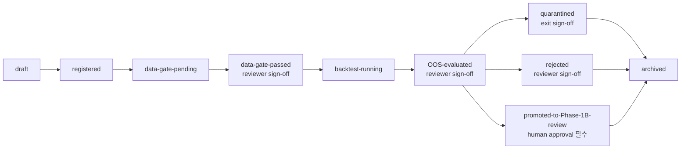

# Phase 1A 실험설계 레드팀 감사

이 감사의 결론은 **`PATCH-BEFORE-IMPLEMENTATION`**이다. 소스 락은 통과했고, primary 문서는 분명 **systematic equity research용 Phase 1A boring baseline 실험설계** 문서다. 다만 구현 전에는 최소한 **레지스트리 재현성·승인·라이선스 필드 보강**, **restatement leakage 및 license lineage의 별도 data gate 추가**, **B9/B10/B11의 trial-family 재구성**, **L9 실행지원과 L11 paper/shadow의 운영적 실체화**, **provisional 수치 문턱의 자동 promote/reject 제거**가 필요하다. 이 판단은 primary, DR-3, DR-4, Lock Sheet의 상호대조와 함께, SEC의 filing API/acceptance timing 안내, WRDS/Compustat의 PIT·restatement·inactive preservation 설명, DeMiguel et al.의 1/N baseline 결과, Harvey–Liu–Zhu의 다중검정 문턱 논의를 보조 근거로 삼았다. fileciteturn0file1 fileciteturn0file3 fileciteturn0file2 fileciteturn0file0 citeturn11view0turn13view0turn14view0turn17view0turn17view1

## 요약과 소스 락

**Executive Summary**

| 핵심 결론 | 판단 | 심각도 |
|---|---|---|
| 소스 락 | 통과 | — |
| 도메인 적합성 | systematic equity research / Phase 1A boring baseline 문서로 확인 | — |
| 고급기법 오염 | 직접 오염은 없음 | — |
| 구현 전 치명 결함 | registry 재현성·승인·라이선스 누락, restatement/license gate 누락 | Critical |
| 구조적 결함 | B9/B10/B11이 sensitivity·scenario·family search를 한 카드에 섞음 | Major |
| 운영 결함 | basic execution support / paper-shadow가 B0–B11 및 artifact 체계에서 약함 | Major |
| house-rule 임계값 | provisional이라면서 일부 auto-gate처럼 사용 | Major |

**Verdict: `PATCH-BEFORE-IMPLEMENTATION`**

- 설계 방향은 DR-3·DR-4·Lock Sheet와 대체로 정합적이다. fileciteturn0file1 fileciteturn0file3 fileciteturn0file2 fileciteturn0file0
- 다만 현재 상태는 **최종 설계 초안**으로는 충분해도 **구현 승인본**으로는 부족하다. 특히 registry/data gate/artifact 계보가 약하다. fileciteturn0file1 fileciteturn0file3
- SEC는 filings/submissions JSON이 실시간에 가깝게 갱신된다고 안내하고, WRDS/Compustat는 Snapshot이 preliminary/original/restated 값을 effective/thru dates와 함께 보존한다고 설명한다. 따라서 filing timestamp와 restatement를 별도 gate로 잠그지 않으면 미래정보 누수 위험이 현실적이다. citeturn11view0turn14view0
- 1/N baseline을 전면에 두는 방향은 적절하다. DeMiguel et al.은 14개 모델이 7개 데이터셋에서 1/N을 일관되게 이기지 못했다고 요약한다. citeturn17view0
- flat한 숫자 문턱을 강하게 잠그는 접근은 위험하다. Harvey–Liu–Zhu는 다중검정 환경에서 factor 유의성의 문턱을 높게 봐야 한다고 논의하며, DR-3도 DSR/PBO와 t-stat 값을 **method lock / calibrated house rule**로 다룬다. citeturn17view1 fileciteturn0file3

**Source Lock Check**

| 요구 대상 | 세션에서 보이는 문서 | 가시성 판정 | 역할 | 근거 |
|---|---|---|---|---|
| `13_phase1a_experiment_design_primary.md` | `13_phase1a_experiment_design_primary(1).md` | Visible | 감사 대상 primary | fileciteturn0file1 |
| DR-3 문서 | `DR-3_Final_Validation_Protocol_v0.1(1).md` | Visible | validation 기준 | fileciteturn0file3 |
| DR-4 문서 | `DR-4_Final_Model_Candidate_Map_v0.1(1).md` | Visible | candidate map 기준 | fileciteturn0file2 |
| 지원 락 문서 | `Integrated_Lock_Sheet_DR1_to_DR2B_v0.1(1).md` | Visible | 상위 lock context | fileciteturn0file0 |

Primary는 문서 첫머리에서 자신을 **“systematic equity research / validation / trading operating system”의 “Phase 1A boring baseline only” 실험 설계**로 정의하고, registry schema, config schema, data acceptance gate, OOS/walk-forward, cost stress, trial budget, lifecycle, report template, failure log template를 모두 포함한다. 반대로 private cloud, VMware, Proxmox, OpenShift, RKE2, Ceph, HCI, TCO, ISMS-P, CSAP, SaaS/PaaS/IaaS 계열 인프라 문서는 아니다. 따라서 **SOURCE LOCK PASS**다. fileciteturn0file1

## 범위와 스키마

**Scope Audit**

아래 표는 primary의 scope lock, DR-4 candidate map, DR-3 validation lock, Lock Sheet 상위 원칙을 대조한 것이다. fileciteturn0file1 fileciteturn0file2 fileciteturn0file3 fileciteturn0file0

| Item | Claude treatment | Correct treatment | Issue | Severity | Patch |
|---|---|---|---|---|---|
| systematic equity research 도메인 | 명시적으로 해당 도메인으로 고정 | 유지 | 없음 | None | 유지 |
| Phase 1A boring baseline only | 명시적 범위 락 | 유지 | 없음 | None | 유지 |
| 고급기법 제외 | penalized reg / learned blending / tree / optimizer / TSFM / LLM / RL 등 제외 | 유지 | 직접 오염 없음 | None | 유지 |
| U.S.-core first, KR later | 명시 | 유지 | 없음 | None | 유지 |
| “수익 최대화가 목적 아님” | 구조 건전성 검증으로 정의 | 유지 | 없음 | None | 유지 |
| house rule은 provisional | 원칙은 맞음 | provisional 값은 auto-gate로 쓰지 않아야 함 | 일부 B행과 지표표에서 사실상 auto promote/reject처럼 작동 | Major | provisional 수치 문턱을 soft/conditional로 재분류 |
| basic execution support | scope에는 포함 | B-matrix, schema, artifact 어디선가 운영화되어야 함 | scope만 있고 실험/설정/아티팩트로 거의 내려오지 않음 | Major | execution-support config 또는 운영 gate artifact 추가 |
| paper/shadow monitoring | scope에는 포함 | lifecycle 또는 artifact로 명시되어야 함 | B0–B11 matrix와 lifecycle에서 실체가 약함 | Major | paper/shadow report/log 및 gate 추가 |
| unknown vendor/data/broker detail 처리 | `Unknown`/`Requires confirmation` 사용 | 유지하되 registry와 fail-closed로 연결해야 함 | 문서 서술은 좋지만 레지스트리 필드·gate와 연결 부족 | Major | license/vendor/broker 상태 필드 추가 |
| Phase 1B / 1C gate | 별도 섹션으로 분리 | 유지 | 전반적으로 정합 | Minor | reviewer/approval trace만 강화 |
| advanced accidentally entered Phase 1A | 직접 진입 없음 | 유지 | 없음 | None | 유지 |
| required Phase 1A baseline element completeness | factor/rank/1N/cost/risk는 있음 | execution/shadow도 operational baseline로 있어야 함 | L9/L11 baseline이 matrix에 약함 | Major | matrix 밖 별도 operational baseline gate 추가 |

**Registry Schema Audit**

Primary registry는 experiment/config/status/search budget의 골격은 잘 잡았지만, 재현성·다중검정·승인·법적 계보 쪽이 약하다. DR-3는 model/feature/hypothesis registry와 approval log, failure log를 validation artifact로 요구하고, primary도 reproducibility를 핵심 목표로 내세우므로, 아래 필드들은 보강이 아니라 사실상 필수 패치에 가깝다. fileciteturn0file1 fileciteturn0file3

| 필드 또는 감사 항목 | 현재 문서 처리 | 판단 | Severity | Required patch |
|---|---|---|---|---|
| `data_license_state` | 없음 | 연구/페이퍼/프로덕션 사용권 상태가 registry에 없음 | Critical | `licensed_research / licensed_paper / licensed_prod / expired / unknown` 추가 |
| `code_version` | 없음 | 재현성 핵심 누락 | Critical | git commit 또는 package manifest digest 추가 |
| `environment_hash` | 없음 | 동일 코드라도 환경 차이를 추적 불가 | Critical | runtime/container hash 추가 |
| `random_seed_policy` | 없음 | 현재 결정론적이어도 `NA`를 명시해야 숨은 stochasticity 방지 가능 | Major | `fixed / deterministic / NA` 필드 추가 |
| `calendar_version` | 없음 | 월말/거래일/휴일 캘린더 재현 불가 | Major | trading calendar version 추가 |
| `rebalance_calendar` | 없음 | 월말 as-of와 실제 체결일 구분 불명확 | Major | `signal_date_rule`, `trade_date_rule` 분리 |
| `benchmark_drift_report_link` | 없음 | benchmark sanity artifact 추적 부족 | Major | 별도 링크 필드 추가 |
| `data_gate_report_link` | 없음 | gate 통과 증빙 연결 부족 | Major | 별도 링크 필드 추가 |
| `cost_stress_report_link` | 없음 | 비용 스트레스 증빙 연결 부족 | Major | 별도 링크 필드 추가 |
| reviewer / approval fields | `approval_required` bool만 존재 | 지나치게 빈약 | Major | `reviewer_id`, `review_stage`, `approval_ts`, `quarantine_release_approver` 추가 |
| trial family / multiple-testing family | `trial_group_id`는 있음 | 부분 충족 | Critical | `trial_family_id`, `family_type`, `effective_N_method` 추가 |
| abandoned trial logging | policy prose는 있음 | registry field 부재 | Major | `abandoned_flag`, `abandoned_reason`, `budget_counted_flag` 추가 |
| execution-support config reference | 없음 | DR-4 baseline의 L9 추적 불가 | Major | `execution_support_config_id` 추가 |
| monitoring/shadow config reference | 없음 | DR-4 baseline의 L11 추적 불가 | Major | `monitoring_config_id` 또는 `paper_shadow_plan_id` 추가 |
| legal/broker confirmation status | 없음 | Unknown을 fail-closed로 연결하지 못함 | Major | `vendor_confirmation_state`, `broker_confirmation_state`, `legal_confirmation_state` 추가 |

**Config Schema Audit**

**Data Snapshot Config**

| 감사 항목 | 내용 |
|---|---|
| missing field | `data_license_state`, `source_release_timestamp`, `timezone`, `calendar_version`, `restatement_mode(as-filed/restated/Snapshot)`, `identifier_link_snapshot_id` |
| over-specified field | `raw_source` enum이 EDGAR/CRSP/Norgate/Sharadar 등에 너무 일찍 묶여 있음 |
| under-specified field | restatement handling은 prose 수준이고 machine-readable selector가 없음 |
| lock status correction | **필드 구조는 Lock now**, raw source/vendor/license는 **Requires data/vendor/legal confirmation** |
| required patch | `source_release_ts`, `restatement_mode`, `license_state`, `timezone/calendar_version`, `id_mapping_snapshot_id` 추가 |

**Universe Config**

| 감사 항목 | 내용 |
|---|---|
| missing field | `trading_calendar_id`, `share_code_whitelist_version`, `exchange_rule`, `IPO_seasoning_rule`, `halted/no-price handling`, `primary_listing_rule` |
| over-specified field | `reconstitution_freq = monthly as-of`를 사실상 기본값처럼 두었는데, scheme 변경 시 새 trial인지 더 명확해야 함 |
| under-specified field | common stock whitelist의 코드집합과 REIT/ADR 등 예외 규칙이 prose 수준 |
| lock status correction | **Provisional** |
| required patch | whitelist/version, IPO seasoning, tradeability exceptions, reconstitution-to-trade rule 명시 |

**Benchmark Config**

| 감사 항목 | 내용 |
|---|---|
| missing field | `benchmark_source_version`, `float_adjustment_mode`, `benchmark_calendar`, `official_comparator_id`, `benchmark_drift_report_link` |
| over-specified field | internal self-built benchmark의 rebal rule이 너무 일찍 월간으로 굳어질 수 있음 |
| under-specified field | 외부 comparator와 내부 self-built benchmark의 역할 분리 기준은 좋지만 drift 판정 체계가 불완전 |
| lock status correction | internal self-built benchmark는 **Lock now**, external reporting benchmark는 **Do not lock yet**, 전체는 **Provisional** |
| required patch | drift를 `internal reconstruction error`와 `external comparator difference`로 분리 |

**Feature Config**

| 감사 항목 | 내용 |
|---|---|
| missing field | `stale_age_cap`, `sector_taxonomy_version`, `as_filed_vs_restated_selector`, `ADV_window`, `missing_value_severity_rule` |
| over-specified field | raw vs neutralized 둘 다 리포트는 좋은 원칙이지만, 반드시 둘 다 trial로 세는지 여부가 불명확 |
| under-specified field | factor 정의, winsor cut, lag exception, low-vol/size-liquidity 정의가 여전히 느슨함 |
| lock status correction | **Provisional** |
| required patch | factor contract를 machine-readable field로 세분화하고 neutralized variant의 trial counting 규칙 추가 |

**Alpha Config**

| 감사 항목 | 내용 |
|---|---|
| missing field | `alpha_family_id`, `sign_convention_id`, `score_clipping_rule`, `long_only_mode`, `seed_policy(NA 가능)` |
| over-specified field | `refresh_frequency = monthly`는 okay but alternative cadence를 찾으면 family budget에 반영되도록 해야 함 |
| under-specified field | B7 composite와 B8 EW blend가 다른 family인지 동일 family인지 schema에서 구분이 안 됨 |
| lock status correction | 규칙 방향은 좋지만 전체는 **Provisional** |
| required patch | aggregation family, score output schema, long-only eligibility, trial-family linkage 추가 |

**Portfolio Config**

| 감사 항목 | 내용 |
|---|---|
| missing field | `signal_to_trade_lag`, `lot_rounding_rule`, `residual_cash_rule`, `no_trade_buffer`, `illiquid_name_drop_rule` |
| over-specified field | `fully invested`는 cap/liq 제한이 강할 때 과도할 수 있음 |
| under-specified field | `top_N`, `caps`, trade-date assumption이 실험 결과에 큰데 yet prose 수준 |
| lock status correction | **Provisional** |
| required patch | trade calendar, rounding/cash, no-trade buffer, liquidity exclusion rule 추가 |

**Risk Config**

| 감사 항목 | 내용 |
|---|---|
| missing field | `sector_taxonomy_version`, `breach_handling_path`, `benchmark_relative_exposure_band`, `watch_to_veto_escalation`, `capacity_bucket_rule` |
| over-specified field | 없음 |
| under-specified field | `turnover_cap`은 Do not lock yet로 두었지만, cap breach 시 lifecycle action이 없음 |
| lock status correction | **Provisional** |
| required patch | breach workflow와 approval path, benchmark-relative exposure fields 추가 |

**Cost Config**

| 감사 항목 | 내용 |
|---|---|
| missing field | `missing_cost_fallback`, `broker_fee_schedule_id`, `spread_model_version`, `slippage_model_version`, `ADV_cap_link`, `FX_mode`, `jurisdiction_mode` |
| over-specified field | `3x 또는 calibrated adverse`는 둘 중 하나 선택이 아니라 별도 scenario family로 관리해야 함 |
| under-specified field | liquidity bucket별 widening 규칙과 fail-closed 규칙이 없음 |
| lock status correction | **Requires data/vendor/broker/legal confirmation** |
| required patch | fallback rule, broker/legal linkage, scenario registry, bucketized spread/ADV stress 추가 |

**Validation Config**

| 감사 항목 | 내용 |
|---|---|
| missing field | `trial_family_id_link`, `DSR_PBO_trigger_rule`, `embargo_applicability_flag`, `regime_coverage_report`, `final_holdout_freeze_id`, `calendar/timezone` |
| over-specified field | `rolling 또는 expanding` 둘 다 허용하면서 primary scheme을 고르지 않음 |
| under-specified field | 무엇이 새 trial인지, scheme 변경이 family count에 어떻게 반영되는지 불명확 |
| lock status correction | **Provisional** |
| required patch | primary WF scheme 1개 명시, alternative는 새 family로 강제, DSR/PBO trigger 추가 |

## 데이터 게이트와 검증 설계

SEC는 EDGAR submissions/companyfacts API를 외부 개발자용 공식 인터페이스로 제공하며, filings dissemination에 따라 실시간으로 갱신되고 typical processing delay가 매우 짧다고 밝힌다. WRDS/Compustat 자료는 inactive firm 보존, Snapshot의 effective/thru dates, preliminary/original/restated 값 보존을 설명한다. 따라서 acceptance timestamp, inactive/delisted, restatement, lineage를 별도 게이트로 막는 것은 과잉이 아니라 기본이다. citeturn11view0turn13view0turn14view0

**Data Acceptance Gate Audit**

| 게이트 항목 | primary 커버리지 | 감사 판단 | Severity | Patch |
|---|---|---|---|---|
| future constituents | G-01 | 적절 | None | 유지 |
| future fundamentals | G-02 | 적절 | None | 유지 |
| filing timestamp leakage | G-03 | 적절 | None | SEC acceptance datetime를 artifact로 저장 |
| restatement leakage | 명시 테스트 없음 | **누락** | Critical | `G-13 Restatement leakage` 추가 |
| inactive/delisted omission | G-04 | 적절 | None | 유지 |
| corporate action errors | G-05 | 적절 | None | 유지 |
| dividend/distribution errors | G-06 | 적절 | None | 유지 |
| missing OHLCV | G-07 | 적절 | Minor | severity-weighted missingness rule 추가 |
| identifier mapping errors | G-11 | 적절하나 artifact 부족 | Major | `id_mapping_snapshot_id` 저장 |
| benchmark replication errors | G-09 | 대체로 적절 | Major | internal reconstruction vs external comparator drift를 분리 |
| cost data errors | G-10 | 현재는 quarantine 중심 | Major | promotion 단계에서는 fail-closed 또는 conservative fallback 강제 |
| data lineage/hash failures | G-12 | 적절 | None | 유지 |
| license lineage failures | 명시 테스트 없음 | **누락** | Critical | `G-14 License lineage` 추가 |

**OOS / Walk-forward Audit**

| 항목 | primary 처리 | 평가 | Severity | Patch |
|---|---|---|---|---|
| chronological split only | 명시적으로 yes | 적절 | None | 유지 |
| no random split | 명시적으로 금지 | 적절 | None | 유지 |
| train / validation / OOS separation | 분리 명시 | 적절 | None | 유지 |
| rolling vs expanding | 둘 다 허용, parameter provisional | **forking risk** | Major | primary scheme 1개 고정, 대안은 새 family |
| final untouched holdout | 1회성·재튜닝 금지 | 적절 | None | holdout freeze artifact 추가 |
| regime coverage | 개념만 있음 | under-specified | Major | regime coverage report 의무화 |
| no test-set tuning | 명시 | 적절 | None | 변경 시 evidence clock reset을 registry에 연결 |
| what counts as a new trial | §12에 산문형 정의 | 부분 충족 | Major | config-change taxonomy를 machine-readable로 추가 |
| purge / embargo treatment | 월간 non-overlap이면 최소/불요, overlap시 필수 | 적절 | Minor | `label_overlap_flag`와 `embargo_rule` 필드 추가 |

## 실험 매트릭스와 측정 정책

1/N을 boring baseline으로 앞세운 것 자체는 맞다. DeMiguel et al.은 sample-based mean-variance와 그 확장들이 1/N을 일관되게 상회하지 못했다고 요약한다. 따라서 baseline matrix는 공격적으로 복잡성을 늘리기보다, **무엇이 trial count를 증가시키는지**를 더 엄격히 막아야 한다. citeturn17view0

**B0–B11 Matrix Audit**

| ID | Phase 1A valid? | performance-seeking risk | data completeness | portfolio construction allowed? | cost/risk sufficiency | promotion/quarantine/reject clarity | action |
|---|---|---|---|---|---|---|---|
| B0 | Yes | Low | 충분 | N/A | benchmark sanity에 적합 | 명확 | **Keep** |
| B1 | Yes | Low | 충분 | Yes | base cost만으로 baseline 충분 | 대체로 명확 | **Keep** |
| B2 | Yes | Medium | value PIT/lag 필요 | Yes | base cost는 충분 | provisional threshold가 다소 강함 | **Keep, thresholds soften** |
| B3 | Yes | Medium | quality PIT 필요 | Yes | 대체로 충분 | B2와 동일 | **Keep, thresholds soften** |
| B4 | Yes | Medium-High | momentum timing 중요 | Yes | turnover shock가 사실상 필수 | base만으로는 약함 | **Keep, attach turnover stress** |
| B5 | Yes | Medium | low-vol 계산 정의 중요 | Yes | raw vs beta-neutral 비교 필요 | quota는 대체로 적절 | **Keep as diagnostic-heavy** |
| B6 | Yes, but diagnostic | Medium | size/liquidity control 데이터 더 필요 | Yes | 충분 | **현재 promote/reject 축이 부적절** | **Keep as attribution diagnostic, not promotion target** |
| B7 | Yes | Medium | 복수 sleeve 완결 필요 | Yes | 충분 | 대체로 명확 | **Keep** |
| B8 | Yes, but overlap with B7 | Medium | B7과 동일 | Yes | 충분 | 목적이 조금 중복 | **Merge with B7 if budget tight; otherwise keep as invariance check** |
| B9 | Yes, but current card is too broad | High | 충분 | Yes | construction별 turnover/capacity 차이 큼 | reject/quarantine가 비어 있음 | **Split into separate pre-registered family** |
| B10 | Yes, but current card is sensitivity family | Medium-High | 충분 | Yes | cost/risk 쪽 의의 큼 | reject/quarantine가 비어 있음 | **Split and treat as sensitivity, not core alpha** |
| B11 | Yes, but not as standalone alpha card | Medium | 충분 | Yes | stress suite로 적절 | 2x active≥0는 과잠금 | **Keep as mandatory scenario evaluation attached to promoted candidates** |

**매트릭스 총평**

| 감사 포인트 | 판단 |
|---|---|
| advanced accidentally entered Phase 1A | **No** |
| required baseline element missing | **Yes — L9 basic execution support, L11 paper/shadow monitoring이 B0–B11에서 운영적으로 약함** |
| merge/split/move later 필요 | **Yes — B8 merge candidate, B9/B10 split, B11 standalone 성격 축소** |

이 결론은 DR-4가 baseline candidate로 **basic execution support**와 **basic monitoring/shadow book**을 포함시키고, DR-3가 paper/shadow gate를 validation concept로 잠근 점을 기준으로 한 것이다. primary는 scope에서는 이를 포함하지만, B0–B11 및 artifact 구조에서는 충분히 운영화하지 못했다. fileciteturn0file2 fileciteturn0file3 fileciteturn0file1

**Metrics Audit**

Harvey–Liu–Zhu가 강조하듯, 유의성 문턱은 다중검정 맥락을 무시한 flat 숫자로 쓰기 어렵다. DR-3도 DSR/PBO/t-stat을 method lock으로 다룬다. 따라서 Phase 1A에서 중요한 것은 “숫자 자체”보다 **숫자가 어떤 class의 experiment에 어떻게 적용되는가**다. citeturn17view1 fileciteturn0file3

| Metric | primary 분류 | 감사 분류 | over-locked numeric threshold? | Patch |
|---|---|---|---|---|
| after-cost excess return | hard gate | **Soft gate overall; conditional hard only for promotion of B2–B8 family** | **Yes** | B0/B1/B9/B10에는 hard gate로 쓰지 말 것 |
| IR | soft gate | Soft gate | **Yes** | `IR>0.25`는 calibration 전 auto action 금지 |
| Rank IC | hard gate | **Diagnostic or conditional hard for signal-sleeve only** | **Yes** | B0/B1/B9/B10/B11에는 적용 제외 |
| turnover | hard gate | **Conditional hard** | Mild | raw turnover보다 cost/capacity breach와 연동 |
| ADV participation | soft gate | **Conditional hard** | **Yes** | 5%/10%는 house rule로만 유지 |
| max drawdown | soft gate | Soft gate | No explicit overlock | benchmark-relative context와 함께 보고 |
| benchmark drift | hard gate | **Hard gate for internal reconstruction; diagnostic for external comparator drift** | Potentially | drift를 두 종류로 분리 |
| data error count | hard gate | Hard gate | Potentially | raw count 대신 severity-weighted |
| DSR / PBO | diagnostic | **Conditional hard once trigger reached** | Under-specified | trigger rule 추가 |
| t-stat | diagnostic only | Report only / diagnostic | No | family-level method lock만 유지 |

**Cost Stress Audit**

| 항목 | primary 처리 | 감사 판단 | Severity | Patch |
|---|---|---|---|---|
| base cost | 있음 | 적절 | None | 유지 |
| 2x cost | 있음, provisional | 적절하나 auto-reject 금지 | Minor | house rule로만 유지 |
| 3x/adverse | 있음 | **둘 중 하나를 택하는 구조는 fork** | Major | `3x`와 `adverse`를 별도 scenario로 등록 |
| spread widening | 있음 | 적절하나 bucket rule 부재 | Major | liquidity bucket별 widening 명시 |
| turnover shock | 있음 | B4/B9에서 사실상 필수 | Major | 해당 family mandatory scenario로 고정 |
| ADV participation | 있음 | 적절 | Minor | risk/execution owner를 명시 |
| missing-cost fallback | section 11에는 있음 | schema에는 없음 | Major | Cost Config에 field 추가 |
| U.S.-first treatment | 있음 | 적절 | None | 유지 |
| KR-later treatment | 있음 | 적절 | None | 유지 |

## 운영 수명주기와 아티팩트

**Trial Budget Audit**

| 항목 | primary 처리 | 감사 판단 | Patch |
|---|---|---|---|
| what counts as a trial | config 1회 평가 = 1 trial | 방향은 맞음 | config change taxonomy를 registry enum으로 추가 |
| what counts as a variant | 단일 파라미터 변경도 새 trial | 적절 | 유지 |
| abandoned trial handling | archival + budget count | prose는 맞음 | registry field에 `abandoned_reason` 추가 |
| failed trial handling | reject + reason | 적절 | downstream invalidation scope 추가 |
| search budget | “낮게”만 명시 | **너무 추상적** | family-level budget cap rule 추가 |
| trial family grouping | `trial_group_id`만 있음 | **불충분** | `trial_family_id`, `family_type`, `effective_N_method` 추가 |
| when DSR/PBO required | “trial 누적되면 시작” | **trigger 불명확** | trigger function 또는 calibrated house trigger 명시 |
| whether unlogged trials invalidate experiment | yes | 적절 | registry/failure log에 invalidation flag 추가 |

**Lifecycle Audit**

primary lifecycle는 requested state set 자체는 잘 갖췄지만, reviewer/sign-off 지점이 너무 느슨하다. DR-3는 promotion lifecycle과 human approval을 lock하고 있고, paper/shadow gate concept도 별도다. 따라서 “full committee approval”까지는 아니더라도, 최소 reviewer sign-off는 더 앞단에 들어와야 한다. fileciteturn0file1 fileciteturn0file3

| State | primary human approval | 권장 human control | Issue | Patch |
|---|---|---|---|---|
| draft | N | N | 없음 | 유지 |
| registered | N | N 또는 lightweight completeness review | 경미 | optional reviewer check |
| data-gate-pending | N | N | 없음 | 유지 |
| data-gate-passed | N | **Reviewer sign-off 필요** | gate 통과 증빙 승인 부재 | reviewer_id / approval_ts 추가 |
| backtest-running | N | N | 없음 | 유지 |
| OOS-evaluated | N | **Reviewer sign-off 필요** | promote/quarantine/reject 직전 통제 약함 | OOS review sign-off 추가 |
| quarantined | N | **exit 시 sign-off 필요** | release governance 없음 | quarantine release approver 추가 |
| rejected | N | reviewer sign-off 권장 | decision trace 약함 | decision reviewer 추가 |
| promoted-to-Phase-1B-review | Y | **Y 유지** | 적절 | 유지 |
| archived | N | N | 없음 | abandoned/rejected reason 보존 강화 |

아래 흐름도는 **권장 패치 버전**이다.

**DR-3 / DR-4 Consistency Check**

| 항목 | primary와의 정합성 | 판단 |
|---|---|---|
| DR-3 data gate first | 대체로 일치 | Pass |
| DR-3 chronological OOS / holdout | 일치 | Pass |
| DR-3 conditional purging | 일치 | Pass |
| DR-3 paper/shadow gate concept | 부분 일치 | **Patch needed** |
| DR-3 validation artifacts | 부분 일치 | **Patch needed** |
| DR-4 boring baseline first | 일치 | Pass |
| DR-4 Phase 1A allow/deny list | 일치 | Pass |
| DR-4 baseline L9 execution support | 부분 일치 | **Patch needed** |
| DR-4 baseline L11 monitoring/shadow | 부분 일치 | **Patch needed** |
| DR-4 Phase 1B/1C gating | 대체로 일치 | Pass |

**Missing Artifacts**

DR-3는 validation artifacts로 multiple-testing report, cost-stress report, capacity report, paper/shadow report, approval log, postmortem template 등을 요구한다. primary의 experiment report와 failure log는 시작점으로는 좋지만, 아래 산출물은 구현 전 별도로 채워져야 한다. fileciteturn0file3 fileciteturn0file1

| missing artifact | 왜 필요한가 |
|---|---|
| data gate report template | gate pass의 증빙이 experiment report에 흡수되어 trace가 흐려짐 |
| benchmark drift report template | self-built benchmark sanity를 별도 artifact로 보존해야 함 |
| cost stress report template | B11과 모든 promoted candidate의 시나리오 결과를 분리 보존해야 함 |
| multiple-testing report template | DSR/PBO/Family count 추적용 |
| capacity report template | turnover/ADV/liquidity 제약 보고용 |
| approval log template | reviewer/human approval trace 보존용 |
| paper/shadow report template | DR-3 concept을 operational artifact로 내리기 위함 |
| postmortem template | repeat failure 학습용 |
| execution-support config / adapter spec | L9 baseline을 실험/운영 양쪽에서 추적하기 위함 |
| monitoring / shadow config | L11 baseline을 matrix 바깥에서도 관리하기 위함 |

## 패치와 잠금 재결정

**Required Patches Before Implementation**

1. experiment registry에 `data_license_state`, `code_version`, `environment_hash`, `random_seed_policy`, `calendar_version`, `rebalance_calendar`를 추가하라.  
2. registry에 `data_gate_report_link`, `benchmark_drift_report_link`, `cost_stress_report_link`, `approval_log_link`를 추가하라.  
3. `trial_group_id`만으로는 부족하므로 `trial_family_id`, `family_type`, `effective_N_method`, `budget_cap_rule`을 분리하라.  
4. abandoned/failed trial을 prose가 아니라 필드(`abandoned_flag`, `abandoned_reason`, `budget_counted_flag`)로 남겨라.  
5. Data Acceptance Gate에 `Restatement leakage`와 `License lineage`를 별도 테스트로 추가하라.  
6. benchmark drift를 `internal reconstruction error`와 `external comparator difference`로 분리하라.  
7. Validation Config에서 **primary walk-forward scheme**를 1개 고정하고, alternative scheme은 새 trial family로 강제하라.  
8. `DSR/PBO required`의 trigger를 prose가 아니라 config/registry rule로 명시하라.  
9. B6를 standalone promote/reject 실험이 아니라 **attribution diagnostic**으로 재분류하라.  
10. B8은 B7과 목적이 중복되므로 **merge 또는 invariance diagnostic**으로 축소하라.  
11. B9와 B10은 하나의 실험 카드가 아니라 **별도 pre-registered family**로 분할하라.  
12. B11은 standalone alpha experiment가 아니라 **promoted candidate에 붙는 mandatory scenario suite**로 재배치하라.  
13. `after-cost active > 0`, `median Rank IC > 0`, `IR > 0.25`, `65% sign stability`, `2x active ≥ 0`, `ADV 5/10`을 모두 **auto promote/reject 금지의 provisional house rule**로 재표기하라.  
14. report template에 `code/env hash`, `seed policy`, `calendar version`, `trial family summary`, `multiple-testing summary`, `capacity summary`, `approval chain`을 추가하라.  
15. failure log에 `downstream invalidation scope`, `rerun eligibility`, `closure reviewer`, `resolution_ts`를 추가하라.  
16. `execution_support_config_id` 또는 동등한 artifact를 도입해 DR-4의 L9 baseline을 운영화하라.  
17. `paper_shadow_plan_id` 또는 동등한 artifact를 도입해 DR-3/DR-4의 paper/shadow baseline을 운영화하라.  
18. `data-gate-passed`, `OOS-evaluated`, `quarantine release`, `Phase-1B promotion`에 reviewer/approver sign-off를 추가하라.  
19. vendor/data/broker/legal의 Unknown 상태는 유지하되, Unknown이면 **fail-closed 또는 conservative fallback**이 작동하도록 registry와 cost/data gate를 연결하라.  
20. 위 패치를 반영한 뒤에만 Phase 1 Final Experiment Design으로 승격하고, 그 전에는 구현/B0 실행을 시작하지 마라.  

**Revised Lock Decision Table**

| 항목 | 재결정 |
|---|---|
| experiment registry schema | **Provisional** |
| data snapshot config | **Requires data/vendor/legal confirmation** |
| universe config | **Provisional** |
| benchmark config | **Provisional** |
| feature config | **Provisional** |
| alpha config | **Provisional** |
| portfolio config | **Provisional** |
| risk config | **Provisional** |
| cost config | **Requires data/vendor/broker/legal confirmation** |
| validation config | **Provisional** |
| data acceptance gate | **Provisional** |
| OOS / walk-forward split | **Lock now** |
| B0–B11 matrix | **Provisional** |
| metrics policy | **Provisional** |
| cost stress | **Provisional** |
| trial budget policy | **Provisional** |
| report template | **Provisional** |
| failure log template | **Provisional** |
| promotion/quarantine/reject lifecycle | **Provisional** |
| Phase 1B gate | **Lock now** |
| Phase 1C gate | **Lock now** |

**Recommendation: `Proceed to Phase 1 Final Experiment Design after patches`**

- primary의 큰 방향은 맞고, DR-3·DR-4와의 충돌은 **부분적 누락/운영화 부족** 수준이다. fileciteturn0file1 fileciteturn0file3 fileciteturn0file2
- 따라서 **primary를 갈아엎기보다 red-team patch를 반영한 Final Experiment Design**으로 가는 편이 합리적이다. fileciteturn0file1
- 다만 구현은 아직 막아야 한다. filing timestamp, restatement, inactive/delisted, license lineage, vendor/broker/legal confirmation이 현재 상태로는 불완전하다. citeturn11view0turn14view0
- 특히 flat threshold를 강한 auto-gate로 쓰면 Phase 1A의 목적이 “정직한 baseline”에서 “임계값 맞추기”로 왜곡된다. citeturn17view1
- 결론적으로 다음 단계는 **Final Design 패치 반영**이며, 그 다음에야 data/vendor/license 확정 후 B0부터 구현 가능하다.