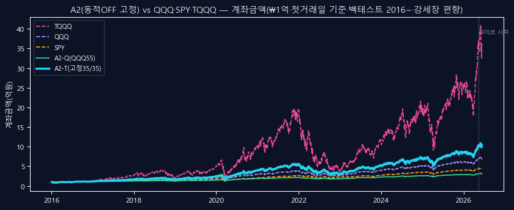
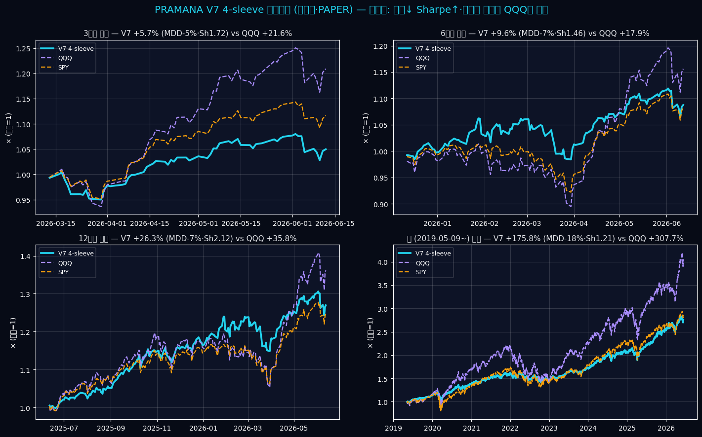
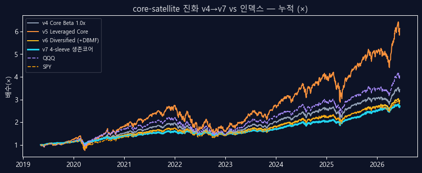
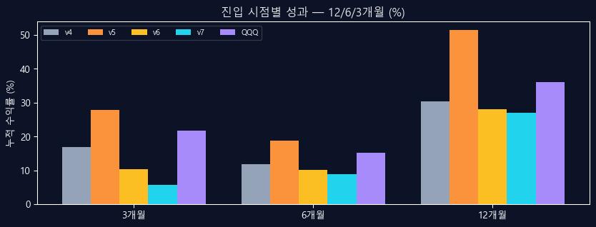

# PRAMANA — Solo + AI Systematic Equity Validation OS

> A solo retail experiment: use **Claude Code + Codex** (adversarial cross-review) to hunt for tradable alpha in US equities/ETFs — and **honestly kill every strategy that doesn't survive validation.**
> **8 generations — all beaten by buy-and-holding TQQQ on *raw return*, and none beat SPY/QQQ on *risk-adjusted alpha* either.** The full, transparent record — including the negative results. (TQQQ is a raw-return foil, not the risk-adjusted benchmark.)

> ⚠️ **Disclaimer:** PAPER ONLY · NO LIVE CAPITAL · virtual ₩100M. This is **not** verified alpha, **not** investment advice, **not** a product. It's an educational/research record of *negative results* + a reusable validation framework. Backtests are regime-biased (2016–2026 bull, no dot-com/2008). Do your own research.

## TL;DR
- **8 generations of strategies, every one honestly rejected** under next-bar · OOS · after-cost · adversarial review.
- **The moment a signal becomes verifiable, it's beta/factor — not alpha** (information theory, in practice).
- **Lost to DCA-ing TQQQ on raw return** (bull regime) — and **no risk-adjusted alpha vs SPY/QQQ**. The two benchmarks are kept separate.
- **Dynamic market-timing = REJECTED** — ablation showed −113%p vs static (lagging-signal wall; 4-for-4 losses across regime-switch / throttle / derisk / laddered overlay).
- **What survived:** a survival core (4-sleeve · −18% MDD vs TQQQ −80%), a *"bad-filing avoidance"* filter (the only consistent directional signal in 8 gens), and immunity to fake alpha.

## Charts

*A2 (fixed 35/35 QQQ/TQQQ + Attack/Moonshot) vs QQQ·SPY·TQQQ — account value, ₩1억 start, backtest 2016~. TQQQ wins on return, but with −80%+ drawdowns the chart's bull window can't show.*


*V7 survival core vs QQQ/SPY across entry points — wins risk-adjusted (Sharpe 1.21), loses cumulative. Diversification premium, not alpha.*


*core-satellite evolution v4→v7 vs QQQ/SPY (cumulative ×, 2019~). v5 leverage hit +513% but Sharpe stayed ≈ QQQ (0.91) — leverage, not skill. Every generation is beta.*


*Returns by entry point (3/6/12mo) — V7 trades cumulative return away for roughly half the drawdown. Risk efficiency, not alpha.*

## The Journey (8 generations)
| Gen | Approach | Verdict |
|---|---|---|
| v1 | cross-sectional factors (value/mom/quality/lowvol) + ML | **FAIL** — Rank IC ≈ 0 · ML ≈ GKX 0.4% OOS R² |
| v3 | full book · trend · leverage · VRP · reversal | **REJECT** — noise · −92% tail · turnover 3660% |
| v4–v7 | core-satellite · leverage · diversification | **beta, not alpha** |
| MT × 4 | regime-switch / throttle / derisk / laddered overlay | **4 losses** — lagging-signal wall |
| Alpha Lab | intraday ORB / VWAP / RVOL | **DEAD** — look-ahead leak once fixed |
| QL | 8-K event drift | "buy" fails OOS / **"avoid bad filings" survives** |
| A1 / A2 | catalyst attack (no lev) / convex raider (QQQ+TQQQ) | paper · honestly labeled |

## Validation OS (the actual contribution)
- **next-bar** execution (signal t → fill t+1 · no same-close leak)
- **OOS** + final holdout · **after-cost** · turnover accounting
- **Adversarial Codex review** — one AI builds, the other tries to `STOP` it (it caught my own look-ahead bugs **twice**)
- **PIT** universe (survivorship-free · self-built S&P 500, corr **0.998** vs real SPY)
- pre-registered kill conditions · frozen-snapshot reproducibility

## Paper forward books (cron-wired · live-ready, trigger unverified · fail-closed)
- **V7** — survival core (4-sleeve diversified · SPY/QQQ/DBMF/GLD/IEF)
- **A1** — catalyst attack (no leverage · Core + Attack + Moonshot + Cash)
- **A2** — Convex Raider (QQQ/TQQQ + Attack/Moonshot + Profit Vault · **dynamic OFF** after REJECT)

## Repo structure
```
phase1a/engine/   runners · ledgers (Attack/Moonshot/Vault) · validators · scanners
PRAMANA_V4/       design docs · lineage · one-line conclusions · lock sheet · A1/A2 books
docs/context/     shared memory (Claude + Codex read the same files)
config/           a2_convex_raider.yaml · revived-components
```

## Reproduce (one command · free data · no API key)
```bash
bash reproduce.sh
```
Builds a venv, installs deps, and runs the pipeline end-to-end on **free yfinance data** — a self-built cap-weight benchmark + 6 integrity gates (weights · survivorship · no-future · total-return · reproducibility · SPY-drift), then the V7 paper runner (yfinance fallback). This proves the *machinery* runs without the paid subscription. The paid, PIT, survivorship-free numbers in `*/reports/*.md` require your own Sharadar key (`NASDAQ_DATA_LINK_API_KEY`); free mode is a survivorship-biased smoke test — trust the gate PASS/FAIL, not the returns.

## Data & disclosure boundary
- **Sharadar (paid · PIT · survivorship-free)** = backtest primary · yfinance (free) = forward/sanity · EDGAR 8-K (free) = filing gate.
- **Public (this repo):** code · validation protocols · pre-registered kill criteria · summary results (`*/reports/*.md`) · non-sensitive dashboards (`*.html`).
- **Not redistributed (gitignored):** all data — Sharadar/Yahoo-derived prices · market caps · PIT membership · paper NAV/ledger (`phase1a/outputs/**/*.{csv,json}`). License/ToS; regenerate locally with your own subscription.

## Honest limitations
- Backtests are **2016–2026 bull-biased** — no dot-com / 2008 (the ETFs are too young). Drawdowns are understated.
- Paper only · not live · in-sample salvage.
- **"No easy alpha for a solo, across 8 registered attempts" is a scope-conditional conclusion** — consistent with recent SPIVA U.S. scorecards (large-cap active funds mostly underperform; rates vary by horizon) and efficient markets. (2016–2026 sample; dot-com/2008 only via proxy — not a universal claim.)

---
*Built with Claude Code + Codex. The point isn't that I found alpha — it's that I **honestly proved I didn't**, with a reusable, adversarially-validated framework. Roasts welcome.*
