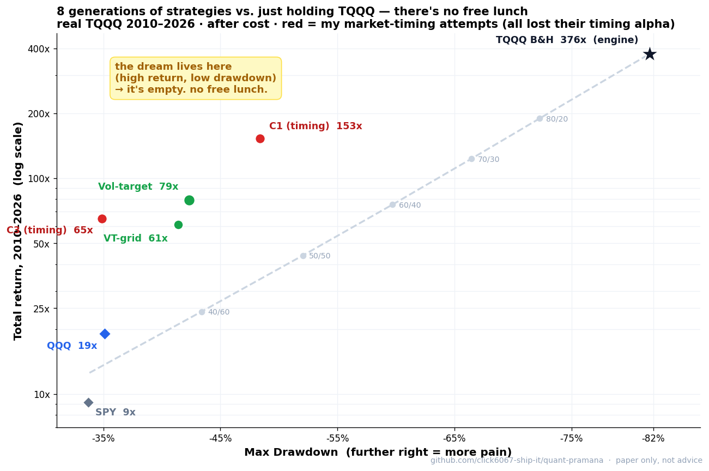

# PRAMANA — Solo + AI Systematic Equity Validation OS

> A solo retail experiment: use **Claude Code + Codex** (adversarial cross-review) to hunt for tradable alpha in US equities/ETFs — and **honestly retire every strategy that doesn't survive validation.**
### 🎯 If you read only this

**8 generations of strategies (v1 → A4). Every one failed to beat buy-and-hold TQQQ on return, and produced no predictive alpha over SPY/QQQ.** Three takeaways:

1. **Known / public methods have no edge** — the moment a signal is verifiable, it's already priced in (beta, not alpha).
2. **What works is risk control, not prediction** — volatility-targeting cuts TQQQ's **−82% crash to ~−42%** while keeping most of the upside. Timing the leveraged asset is dead (every timing rule lost to just holding the same average exposure).
3. **The real result is a discipline that refused to fake a win** — pre-registered kill-criteria, point-in-time data, and an adversarial second AI that caught my own look-ahead bugs twice.

📊 **Live dashboard (every chart):** https://click6067-ship-it.github.io/quant-pramana/pramana_journey_dashboard.html

> 🗄️ **Data actually used:** **Sharadar** (Nasdaq Data Link · *paid · point-in-time · survivorship-free*) — daily prices (SEP), ETF prices (SFP), historical market cap (DAILY), fundamentals (SF1), delistings/dividends/S&P 500 membership (TICKERS/ACTIONS/SP500) → backtest primary · **yfinance** (free) — TQQQ/QQQ/SPY/DBMF/GLD/IEF back to 2010, forward & sanity cross-check · **SEC EDGAR** (free) — 8-K filings with real public timestamps (catalyst/NEG gate) · **^IRX** — T-bill yield for the cash sleeve. *("Public data" below means publicly-available information — no private/insider edge — **not** "free data only"; the backtest spine is paid Sharadar.)*

> ⚠️ **PAPER ONLY · no live capital · virtual ₩100M · not investment advice.** An educational record of *negative results* + a reusable validation framework. Backtests are 2010–2026 (mostly bull; no dot-com / 2008 — the leveraged ETFs are too young), so drawdowns are understated. TQQQ targets 3× the *daily* Nasdaq-100 return (inception 2010-02-09); long holds diverge from 3× the index. DYOR.

---

### Claim → Evidence → Caveat

| Claim | Evidence | Caveat |
|---|---|---|
| Known/public methods → no predictive alpha | 8 gens retired · factor IC-IR < 0.05 · Timing Log Alpha all negative | Scope: US equity/ETF · Sharadar PIT + yfinance + EDGAR · after-cost |
| Nothing beat TQQQ on raw return | TQQQ 376× vs best strategy 153× (2010–26) | Regime-conditional (2010–26 bull; no dot-com/2008) |
| What works is risk control, not alpha | Vol-target: −82% → −42% MDD at ≈ QQQ Sharpe | Exposure sizing, not prediction |
| The framework is the contribution | Self-built PIT index corr **0.998** vs SPY · caught 2 look-ahead bugs | Paper only · capital authority = 0 |

---

## The story (how this actually went)

I started by applying the *validated, textbook* methods Claude and Codex recommended — factors, diversification, risk control. Generation after generation they got safer and more refined, but **none of them beat simply buying SPY or QQQ.** First lesson: *known, safe, already-published methods are priced in — they don't generate returns.*

So I flipped. If alpha exists, it comes from what others don't know, from bearing risk, from an information edge you earn by digging — not from public chart patterns (momentum, Elliott waves, candlesticks), which are already reflected in price. I deliberately went where the LLMs advised *against*: researched on my own, aggregated expert opinion (Reddit), built an aggressive catalyst book (A1). **It still couldn't beat simply accumulating leveraged TQQQ.**

If I couldn't beat TQQQ on return, I wanted to at least **soften its brutal drawdown** into something more attractive to hold. So I tried timing — ratios, volatility formulas, cutting and re-adding exposure (A2 → A4). The verdict: every timing rule lost, *on compounding*, to just holding the same average exposure. **The return was never the timing — it was the exposure.**

The honest endpoint isn't a clever model. It's: *size the leverage you can actually survive, control it with volatility, and stop trying to outsmart it.* That isn't failure — it's the project finishing honestly.

---

## Charts


*8 generations vs just holding TQQQ (real TQQQ 2010–2026, after cost). TQQQ wins on return but with −82% drawdown; vol-target (green) sits left of the static frontier = same return at less pain; my market-timing attempts (red) never beat the line. The top-left "dream" zone is empty — no free lunch.*


*A2 (fixed 35/35 QQQ/TQQQ + Attack/Moonshot) vs QQQ·SPY·TQQQ — account value, ₩100M start, backtest 2016~. TQQQ wins on return, but with −80%+ drawdowns the bull window can't show.*


*Core-satellite evolution v4→v7 vs QQQ/SPY (cumulative ×, 2019~). v5 leverage hit +513% but Sharpe stayed ≈ QQQ (0.91) — leverage, not skill. Every generation is beta.*


*V7 survival core vs QQQ/SPY across entry points — wins risk-adjusted (Sharpe 1.21), loses cumulative. Diversification premium, not alpha.*


*Returns by entry point (3/6/12mo) — V7 trades cumulative return for roughly half the drawdown. Risk efficiency, not alpha.*

> The [interactive dashboard](https://click6067-ship-it.github.io/quant-pramana/pramana_journey_dashboard.html) has the full set: Return-vs-Pain map, timing attribution, ₩100M multi-anchor entry curves, and methodology.

---

## The Journey (8 generations)

| Gen | Approach | Verdict |
|---|---|---|
| **v1–v2** | cross-sectional factors (value/momentum/quality/lowvol) + simple ML | **FAIL** — Rank IC ≈ 0 (IC-IR < 0.05) · ML ≈ GKX 0.4% OOS R² |
| **v3** | full book · trend · leverage · VRP · reversal | **REJECT** — noise · deep tail · turnover 3660% |
| **v4–v7** | core-satellite · leverage · 4-sleeve diversification | **beta, not alpha** (v7 survival core: −18% MDD vs TQQQ −80%, but gives up ~half of QQQ's bull) |
| **MT × 4** | regime-switch / throttle / derisk / laddered overlay | **4 losses** — the lagging-signal wall |
| **Alpha Lab** | intraday ORB / VWAP / RVOL setups | **DEAD** — look-ahead leak once fixed; false-breakout 56% |
| **QL** | 8-K event drift | "buy the catalyst" fails OOS / **"avoid bad filings" survives as a filter** |
| **A1 / A2 / AX** | catalyst attack (no lev) / convex raider (QQQ+TQQQ) / option convexity | **DEAD** — Attack/Moonshot blind backtests flat; even leverage/shorts/options didn't help |
| **A3 / A4** | TQQQ "War Engine" (vault timing) / vault study + attribution | **A3 PARTIAL** (defends drawdown, loses to QQQ) → **A4 NULL** (timing unnecessary; vol-target is the answer) |

> **The one directional signal that survived 8 generations: *avoiding bad 8-K filings*** — a NEG/negative-news risk filter, timestamped via SEC EDGAR `acceptanceDateTime`. It is **not** a standalone buy-alpha ("buy the catalyst" failed OOS), but as a *risk filter* it was the only consistent directional edge, and it feeds the A1/A2 NEG gate.

---

## Why did everything fail? (interpretation)

**Why no alpha?** Alpha is an inefficiency the market *doesn't yet know about*. Everything tried here used **publicly-available data** (Sharadar's paid-but-public PIT prices & fundamentals, free yfinance, SEC EDGAR filings) **+ already-known methods** (textbook factors, chart techniques). Known signals are traded by everyone at once, so they are arbitraged into price and the premium disappears. US large caps are the most efficient, most competitive market on earth — SPIVA scorecards repeatedly show the large majority of active large-cap funds trail the S&P 500 over long horizons. A solo retail trader, on public data, after costs, has a base rate near zero. The genuine sources of alpha (private information edge, structural risk-bearing, execution speed, capital capacity) aren't available to a solo on public data. → Not "failure," but an honest confirmation of efficient markets — and *not manufacturing fake alpha across 8 generations is the real result.*

**Why these chart shapes?**
- *Factor IC ≈ 0* → known factors are already priced in.
- *Nothing beats SPY/QQQ* → efficiency + transaction cost; diversification lowers risk, not return.
- *TQQQ 376× with −82%* → leverage compounding in a bull (beta × 3), not skill; −82% is the structural cost of leverage.
- *Vol-target sits left of the static frontier* → controlling volatility takes the same return with less risk (avoiding leverage decay) — a better risk *shape*, not alpha.
- *All timing alphas negative* → lagging signals + a leveraged asset that snaps back hard after crashes → cutting exposure forfeits the rebound → cash drag > defense.

**Why is the conclusion "vol-target"?** Future returns can't be estimated (a stable 20-day expected return doesn't exist). When you can't predict, the only controllable variable is *position size / risk*. Scaling exposure by realized volatility halves TQQQ's drawdown (−82% → −42%) **without any alpha**. The honest best under zero predictive edge = *"leverage you can actually hold."*

---

## Key results (the charts, in numbers)

Real, after-cost, point-in-time, next-bar — reconstructed from `phase1a/outputs/a4/*.csv`.

### 1) Return vs Pain — there is no free lunch (real TQQQ 2010–2026)

| Strategy | Total return | Max drawdown | Sharpe |
|---|--:|--:|--:|
| **TQQQ** buy & hold | **376×** | **−82%** | 0.90 |
| Static 70/30 TQQQ/cash | 123× | −66% | 0.92 |
| C1 (A4 timing candidate) | 153× | −48% | 0.92 |
| **VT-CANON** (vol-target) | **79×** | **−42%** | **1.00** |
| C3 (defensive state machine) | 65× | −35% | 0.98 |
| QQQ | 19× | −35% | 0.98 |
| SPY | 9× | −34% | 0.88 |

The top-left — *high return AND low drawdown* — is permanently empty. *(376× is conditional on the 2010–2026 bull/tech regime; dot-com/2008 unverified — TQQQ was born 2010.)*

### 2) Factor predictive power ≈ 0 (S&P 500, IC-IR; tradeable ≈ 0.30)

value −0.029 · quality +0.022 · momentum +0.045. Even the best is ~1/7 of the bar — noise, before cost or multiple-testing.

### 3) "Timing" is just exposure (A4 Stage A attribution)

Every dynamic policy reduced to a daily knob `w_t` = TQQQ weight, then compared **on compounding** to a static book at the *same average weight* (**Timing Log Alpha** = Σ ln(1+r_policy) − Σ ln(1+r_static_at_avg_weight)):

| Policy | Total | Static at same avg weight | Timing Log Alpha |
|---|--:|--:|--:|
| VT-CANON | 79× | 99× | **−0.22** |
| C1 | 153× | 211× | **−0.32** |
| C3 | 65× | 72× | **−0.10** |

**All negative — even before costs.** The return came from *how much* TQQQ you held, not *when*.

### 4) Capture vs Pain (vs the TQQQ engine)

VT-CANON keeps **74%** of TQQQ's upside while dodging **48%** of its drawdown · C1 = 85% / 41% · C3 = 70% / 57% · Static 70/30 = 81% / 19% · QQQ = 50% / 57%. No strategy keeps all the upside *and* dodges all the pain.

### 5) Same ₩100M, different entry points

- **10y ago:** TQQQ 39.8억 (but −82% along the way) > QQQ 7.2억 > v4 Core-Beta 5.5억 > SPY 4.2억.
- **3y ago:** TQQQ 4.2억 (−58%) > v5 > v6 > QQQ 2.0억 … but **v7 4-sleeve = 1.7억 with only −12% drawdown** (one-fifth the pain).

TQQQ always wins terminal value and always carries the deepest drawdown.

---

## Current status (2026-06-15)

| Thread | State |
|---|---|
| **V7** 4-sleeve survival core (SPY/QQQ/DBMF/GLD/IEF · 1.0×) | active **paper** (forward, cron-wired) |
| **A1** catalyst attack / **A2** Convex Raider (QQQ/TQQQ + Vault) | paper / accounting · A2 **dynamic allocator OFF** after −113%p ablation REJECT |
| **A3** TQQQ War Engine (vault timing) | **PARTIAL** — defends drawdown, loses to QQQ · branch unmerged |
| **A4** vault study + attribution | **NULL** — timing unnecessary, vol-target is the answer |
| **AX** aggressive pivot (options/leverage/shorts) | **DEAD** — no graduation; all sleeves failed pre-registered gates |
| **Capital authority** | **0 — paper only**; any real money is a separate, explicit human decision |

---

# Technical reference (below)

## Methodology

### Data — what, why, characteristics

| Source | What | Why | Characteristics |
|---|---|---|---|
| **Sharadar SEP** (paid · PIT) | US stock daily close (dividend-adjusted) | backtest price base | Point-in-Time → no survivorship / no look-ahead |
| **Sharadar SFP** | ETF fund prices | benchmarks · sleeves | adjusted ETF closes |
| **Sharadar DAILY** | market cap (historical) | self-built cap-weight index | historical marketcap (not current-only) |
| **Sharadar SF1** | fundamentals (gp/assets …) | quality factor | PIT-by-datekey (filing-time aware) |
| **Sharadar TICKERS · ACTIONS · SP500** | delistings · dividends · membership | survivorship removal · PIT universe | permaticker · isdelisted · as-of membership |
| **yfinance** (free) | TQQQ/QQQ/SPY/DBMF/GLD/IEF (2010+) | reaches TQQQ inception (2010) · fallback | auto-adjusted · sanity cross-check |
| **SEC EDGAR** (free) | 8-K filings (34,381 events / 200 names) | catalyst / event studies (A1/A2) | acceptanceDateTime = actual public timestamp → blocks look-ahead |
| **^IRX** (free) | T-bill yield | cash return (not 0%) | the cash sleeve for vol-target |

**Why Sharadar (paid)?** Cheapest *clean* PIT data. Point-in-Time = you only see "what was knowable on that date," which blocks **look-ahead leakage** and **survivorship bias** — the two biggest manufacturers of fake alpha. Free yfinance reaches 2010 (TQQQ's birth) for the TQQQ experiments and cross-checks.

### Core formulas (plain-language)

- **Vol-target weight:** `w_t = clip( target_vol ÷ recent_vol , 0 , cap )` — scale TQQQ down when volatile, up when calm. **Zero prediction.**
- **Realized volatility:** `σ = std(last 21 daily returns) × √252`.
- **Next-bar execution:** signal at today's close → fill **tomorrow** (blocks same-day look-ahead).
- **Factor power (IC-IR):** `mean(Rank IC) ÷ std(Rank IC)` — 0.3 to be tradeable; ours all < 0.05.
- **Timing Log Alpha (the verdict):** `Σ ln(1+r_policy) − Σ ln(1+r_static_at_avg_weight)` — positive = real timing skill; negative = exposure effect. Result: all negative.
- **Leveraged-ETF expected log growth:** `≈ 3μ − 4.5σ²` — volatility (σ²) eats returns (decay) → why volatility control matters for leverage.
- **Capture / pain:** `capture = ln(strategy ×) ÷ ln(TQQQ ×)`, `pain avoided = 1 − strategy_MDD ÷ TQQQ_MDD`.
- **Drawdown recovery:** `required gain = 1 ÷ (1 − DD) − 1` — −42% needs +72%, −82% needs +456% (non-linear).

### How timing was computed and validated (procedure)

1. **Reduce every strategy to one knob `w_t`** = today's TQQQ weight. Daily return = `w_t × r_TQQQ + (1−w_t) × r_cash − cost`. All models now compare on one ruler.
2. **Each policy's rule for `w_t`** (data up to *yesterday* only): VT = target_vol ÷ recent_vol; C1 = cash on shock/trend-break, else ramp toward VT ≤5%p/day; C2 = C1 + halve in decay; C3 = fixed 70% + state gates. All **next-bar**.
3. **Real timing? — exposure-matched comparison.** Build a static book at the policy's *average* weight; compare on compounding (Timing Log Alpha). Lose to it → the return was exposure, not timing.
4. **Attribution:** Timing P&L (held more on good days?) · Cash Drag vs Defense Benefit (de-risking net good/bad?) · Missed Recovery (sat out the rebound?).
5. **Pre-registered falsification (A4-0):** baselines first → diagnostic heatmap (diagnostic *only*, never a rule generator) → register 3–5 candidates *before* results → judge full-path on pseudo-OOS (2022–26) + purged folds → if nothing beats vol-target, the pre-registered NULL fires. No post-hoc candidates or threshold tuning.

### The 7 anti-fake-alpha gates

1. **PIT data** — only what was knowable then → blocks look-ahead & survivorship.
2. **Next-bar execution** — fill the day after the signal → blocks same-day leakage.
3. **Pre-registration (falsification)** — success/kill criteria fixed *before* results; the NULL is registered too, so you can't rescue a dead strategy by tuning.
4. **After-cost** — turnover × spread + T-bill cash → kills paper profits.
5. **OOS split + purged walk-forward** — 2010–21 design / 2022–26 pseudo-OOS, overlapping labels embargoed.
6. **Multiple-testing correction (DSR · PBO)** — many tries look good by luck → Deflated Sharpe & Probability of Backtest Overfitting discount it.
7. **Adversarial cross-review (Claude × Codex)** — one AI builds, the other cold-reviews the code and tries to `STOP` it (no echo). Caught two real look-ahead bugs (RVOL, A2 same-day).

➕ **Pipeline validation:** the self-built PIT S&P 500 cap-weight index correlates **0.998** with the real SPY — strong evidence the data/processing (dividends, delistings, membership) is correct. *The tools were accurate; there simply was no alpha to find.*

## Validation OS (the actual contribution)

Even with zero alpha, the reusable asset is the framework: PIT survivorship-free universe (self-built S&P 500, corr 0.998 vs SPY) · next-bar execution · OOS + final holdout · after-cost + turnover accounting · pre-registered kill conditions · frozen-snapshot reproducibility · DSR/PBO multiple-testing control · and an adversarial second AI that tries to break every result.

## Paper forward books (cron-wired · live-ready, trigger unverified · fail-closed)
- **V7** — survival core (4-sleeve diversified · SPY/QQQ/DBMF/GLD/IEF · 1.0×).
- **A1** — catalyst attack (no leverage · Core + Attack + Moonshot + Cash).
- **A2** — Convex Raider (QQQ/TQQQ + Attack/Moonshot + Profit Vault · **dynamic allocator OFF** after the −113%p ablation REJECT).

## Repo structure
```
phase1a/engine/   runners · ledgers (Attack/Moonshot/Vault) · validators · scanners · a4_* attribution
phase1a/reports/  per-experiment result write-ups (the real, paid-data numbers)
PRAMANA_V4/       design docs · lineage · one-line conclusions · lock sheet · A1/A2 books
docs/context/     shared memory (Claude + Codex read the same files)
docs/             GitHub Pages — live dashboard + system map
config/           a2_convex_raider.yaml · revived-components · a4 protocols
```

## Smoke-test the machinery (one command · free data · no API key)
```bash
bash reproduce.sh
```
Builds a venv, installs deps, and runs the pipeline end-to-end on **free yfinance data** — a self-built cap-weight benchmark + 6 integrity gates (weights · survivorship · no-future · total-return · reproducibility · SPY-drift), then the V7 paper runner. This validates the *machinery*, **not the headline returns.** The paid, PIT, survivorship-free numbers in `*/reports/*.md` are report-reproducible only with your own Sharadar key (`NASDAQ_DATA_LINK_API_KEY`); free mode is a survivorship-biased smoke test — trust the gate PASS/FAIL, not the returns.

## Data & disclosure boundary
- **Sharadar (paid · PIT · survivorship-free)** = backtest primary · yfinance (free) = forward/sanity · EDGAR 8-K (free) = filing gate.
- **Public (this repo):** code · validation protocols · pre-registered kill criteria · summary results (`*/reports/*.md`) · non-sensitive dashboards (`*.html`).
- **Not redistributed (gitignored):** all data — Sharadar/Yahoo-derived prices · market caps · PIT membership · paper NAV/ledger (`phase1a/outputs/**/*.{csv,json}`). License/ToS; regenerate locally with your own subscription.

## Honest limitations
- Backtests are **2010–2026, mostly bull** — no dot-com / 2008 (the leveraged ETFs are too young). Drawdowns are understated; leverage results are regime-conditional.
- Paper only · not live · in-sample salvage risk.
- v6/v7 (4-sleeve) cannot reach 10 years because DBMF is 2019-born (not backfilled); A1/A2 are forward-only (days). Gaps are shown honestly, never proxied.
- **"No easy alpha for a solo across 8 registered attempts" is a scope-conditional conclusion** — consistent with SPIVA U.S. scorecards and efficient markets, *not* a universal claim that alpha cannot exist.

---
*Built with Claude Code + Codex. The contribution is not alpha — it is a reproducible, adversarially-validated framework and a documented negative-result ledger.*
